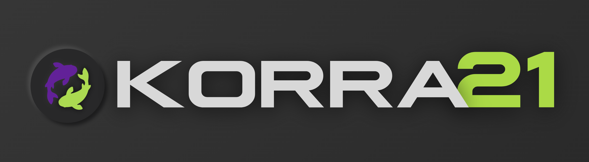

<p align="center">
  
</p>

# Korra 21 ☤
<p align="center">
  <a href="https://github.com/ceremoneymeister-bit/Korra.twenty.one">Private repository</a> | <code>ghcr.io/ceremoneymeister-bit/korra.twenty.one</code>
</p>
<p align="center">
  <a href="https://github.com/ceremoneymeister-bit/Korra.twenty.one"></a>
  <a href="LICENSE"></a>
  <a href="README.zh-CN.md"></a>
  <a href="README.ur-pk.md"></a>
  <a href="README.es.md"></a>
</p>

**Korra is a self-improving AI agent and a private hard fork of Hermes Agent
0.21.** It has a built-in learning loop: it creates skills from experience,
improves them during use, persists knowledge, searches past conversations, and
builds a deepening model of who you are across sessions. Upstream authorship and
licensing are preserved in [LICENSE](LICENSE).

Use any model you want — Nous Portal, OpenRouter, OpenAI, your own endpoint, and
the providers included in the installed build. Inspect them with
`hermes model --help`; switch with `hermes model` — no code changes, no lock-in.

<table>
<tr><td><b>A real terminal interface</b></td><td>Full TUI with multiline editing, slash-command autocomplete, conversation history, interrupt-and-redirect, and streaming tool output.</td></tr>
<tr><td><b>Lives where you do</b></td><td>Telegram, Discord, Slack, WhatsApp, Signal, and CLI — all from a single gateway process. Voice memo transcription, cross-platform conversation continuity.</td></tr>
<tr><td><b>A closed learning loop</b></td><td>Agent-curated memory with periodic nudges. Autonomous skill creation after complex tasks. Skills self-improve during use. FTS5 session search with LLM summarization for cross-session recall. <a href="https://github.com/plastic-labs/honcho">Honcho</a> dialectic user modeling. Compatible with the <a href="https://agentskills.io">agentskills.io</a> open standard.</td></tr>
<tr><td><b>Scheduled automations</b></td><td>Built-in cron scheduler with delivery to any platform. Daily reports, nightly backups, weekly audits — all in natural language, running unattended.</td></tr>
<tr><td><b>Delegates and parallelizes</b></td><td>Spawn isolated subagents for parallel workstreams. Write Python scripts that call tools via RPC, collapsing multi-step pipelines into zero-context-cost turns.</td></tr>
<tr><td><b>Runs anywhere, not just your laptop</b></td><td>Seven terminal backends — local, Docker, SSH, Singularity, Modal, Daytona, and Vercel Sandbox. Daytona and Modal offer serverless persistence — your agent's environment hibernates when idle and wakes on demand, costing nearly nothing between sessions. Run it on a $5 VPS or a GPU cluster.</td></tr>
<tr><td><b>Research-ready</b></td><td>Batch trajectory generation, trajectory compression for training the next generation of tool-calling models.</td></tr>
</table>

---

## Quick Install

Korra's source repository,
[`ceremoneymeister-bit/Korra.twenty.one`](https://github.com/ceremoneymeister-bit/Korra.twenty.one),
is private. Client installations use the ready-made container image; there is
no public shell or PowerShell installer. Authenticate to GHCR first if your
account is prompted for package access.

### Linux, macOS, WSL2

```bash
docker pull ghcr.io/ceremoneymeister-bit/korra.twenty.one:latest
docker run --rm -it \
  -v "${HOME}/.hermes:/opt/data" \
  ghcr.io/ceremoneymeister-bit/korra.twenty.one:latest
```

### Windows (Docker Desktop, PowerShell)

Run the ready-made image directly (source installs use `scripts/install.ps1`
and need access to this private repository):

```powershell
docker pull ghcr.io/ceremoneymeister-bit/korra.twenty.one:latest
docker run --rm -it `
  -v "${env:USERPROFILE}/.hermes:/opt/data" `
  ghcr.io/ceremoneymeister-bit/korra.twenty.one:latest
```

For the background gateway and dashboard on Windows, use the supplied compose
file:

```powershell
docker compose -f docker-compose.windows.yml pull
docker compose -f docker-compose.windows.yml up -d
```

The mounted `.hermes` directory keeps configuration and sessions between
container runs. Termux does not have a separate public client installer in this
fork.

## Getting Started

```bash
hermes              # Interactive CLI — start a conversation
hermes model        # Choose your LLM provider and model
hermes tools        # Configure which tools are enabled
hermes config set   # Set individual config values
hermes config get   # Print individual config values
hermes gateway      # Start the messaging gateway (Telegram, Discord, etc.)
hermes setup        # Run the full setup wizard (configures everything at once)
hermes claw migrate # Migrate from OpenClaw (if coming from OpenClaw)
hermes update       # Update to the latest version
hermes doctor       # Diagnose any issues
```

The installed build is authoritative: start with `hermes --help` and
`hermes <command> --help`, then inspect its source code when more detail is
needed.

---

## Skip the API-key collection — Nous Portal

Korra works with whatever provider you want. If you'd rather not collect five
separate API keys for the model, web search, image generation, TTS, and a cloud
browser, the built-in **Nous Portal** integration can cover them under one
subscription:

- **300+ models** — pick any of them with `/model <name>`
- **Tool Gateway** — web search (Firecrawl), image generation (FAL), text-to-speech (OpenAI), cloud browser (Browser Use), all routed through your sub. No extra accounts.

One command from a fresh install:

```bash
hermes setup --portal
```

That logs you in via OAuth, sets Nous as your provider, and turns on the Tool
Gateway. Check what's wired up with `hermes portal info`; use
`hermes portal --help` and the installed provider code for details that match
this build.

You can still bring your own keys per-tool whenever you want — the gateway is per-backend, not all-or-nothing.

---

## CLI vs Messaging Quick Reference

Korra has two entry points: start the terminal UI with `hermes`, or run the
gateway and talk to it from Telegram, Discord, Slack, WhatsApp, Signal, or
Email. Once you're in a conversation, many slash commands are shared across
both interfaces.

| Action                         | CLI                                           | Messaging platforms                                                              |
| ------------------------------ | --------------------------------------------- | -------------------------------------------------------------------------------- |
| Start chatting                 | `hermes`                                      | Run `hermes gateway setup` + `hermes gateway start`, then send the bot a message |
| Start fresh conversation       | `/new` or `/reset`                            | `/new` or `/reset`                                                               |
| Change model                   | `/model [provider:model]`                     | `/model [provider:model]`                                                        |
| Set a personality              | `/personality [name]`                         | `/personality [name]`                                                            |
| Retry or undo the last turn    | `/retry`, `/undo`                             | `/retry`, `/undo`                                                                |
| Compress context / check usage | `/compress`, `/usage`, `/insights [--days N]` | `/compress`, `/usage`, `/insights [days]`                                        |
| Browse skills                  | `/skills` or `/<skill-name>`                  | `/<skill-name>`                                                                  |
| Interrupt current work         | `Ctrl+C` or send a new message                | `/stop` or send a new message                                                    |
| Platform-specific status       | `/platforms`                                  | `/status`, `/sethome`                                                            |

For the full command lists, use `hermes --help`,
`hermes gateway --help`, and the installed command code.

---

## Documentation

Korra has no external documentation site. The source of truth is the installed
build:

| Topic | Where to verify |
| --- | --- |
| CLI and setup | `hermes --help`, `hermes <command> --help` |
| Configuration and environment | `hermes config --help`, `hermes config env-path`, installed configuration code |
| Providers and models | `hermes model --help`, installed provider plugins |
| Messaging gateway | `hermes gateway --help`, installed platform adapters |
| Tools and toolsets | `hermes tools --help`, `hermes tools list`, `toolsets.py` |
| Skills | `hermes skills --help`, `hermes skills browse`, installed skills |
| Development and architecture | `AGENTS.md` and the checked-out source tree |

---

## Migrating from OpenClaw

If you're coming from OpenClaw, Korra can automatically import your settings,
memories, skills, and API keys.

**During first-time setup:** The setup wizard (`hermes setup`) automatically detects `~/.openclaw` and offers to migrate before configuration begins.

**Anytime after install:**

```bash
hermes claw migrate              # Interactive migration (full preset)
hermes claw migrate --dry-run    # Preview what would be migrated
hermes claw migrate --preset user-data   # Migrate without secrets
hermes claw migrate --overwrite  # Overwrite existing conflicts
```

What gets imported:

- **SOUL.md** — persona file
- **Memories** — MEMORY.md and USER.md entries
- **Skills** — user-created skills → `~/.hermes/skills/openclaw-imports/`
- **Command allowlist** — approval patterns
- **Messaging settings** — platform configs, allowed users, working directory
- **API keys** — allowlisted secrets (Telegram, OpenRouter, OpenAI, Anthropic, ElevenLabs)
- **TTS assets** — workspace audio files
- **Workspace instructions** — AGENTS.md (with `--workspace-target`)

See `hermes claw migrate --help` for all options, or use the `openclaw-migration` skill for an interactive agent-guided migration with dry-run previews.

---

## Contributing

Contributions are handled in the private
[`ceremoneymeister-bit/Korra.twenty.one`](https://github.com/ceremoneymeister-bit/Korra.twenty.one)
repository. You need explicit repository access; read `AGENTS.md` in the
checkout for development rules and use the checked-out source as the technical
reference.

Clone into the standard development layout after authenticating to GitHub:

```bash
gh repo clone ceremoneymeister-bit/Korra.twenty.one \
  "${HERMES_HOME:-$HOME/.hermes}/hermes-agent"
cd "${HERMES_HOME:-$HOME/.hermes}/hermes-agent"
curl -LsSf https://astral.sh/uv/install.sh | sh
uv venv ~/.hermes/venvs/hermes-dev --python 3.11
source ~/.hermes/venvs/hermes-dev/bin/activate
uv pip install -e ".[all,dev]"
scripts/run_tests.sh
```

For CI or another checkout location, clone the same private repository with
credentials that have access. Client users do not need a source checkout; they
run the prebuilt GHCR image from the installation section.

Create the venv outside the cloned source tree — a venv inside the directory
the agent operates from can be wiped by a relative-path command the agent runs
against its own checkout, destroying the running runtime mid-session.

---

## Project Links

- 🔒 [Private repository](https://github.com/ceremoneymeister-bit/Korra.twenty.one)
- 🐛 [Private issue tracker](https://github.com/ceremoneymeister-bit/Korra.twenty.one/issues)
- 📚 [Skills Hub](https://agentskills.io)
- 🔌 [computer-use-linux](https://github.com/avifenesh/computer-use-linux) — Linux desktop-control MCP server for Korra and other MCP hosts, with AT-SPI accessibility trees, Wayland/X11 input, screenshots, and compositor window targeting.
- 🔌 [HermesClaw](https://github.com/AaronWong1999/hermesclaw) — Community WeChat bridge compatible with the `hermes` command and OpenClaw.

---

## License

MIT — see [LICENSE](LICENSE).

Korra 21 is a private hard fork of Hermes Agent 0.21. Upstream authorship and
license notices are preserved in [LICENSE](LICENSE).
